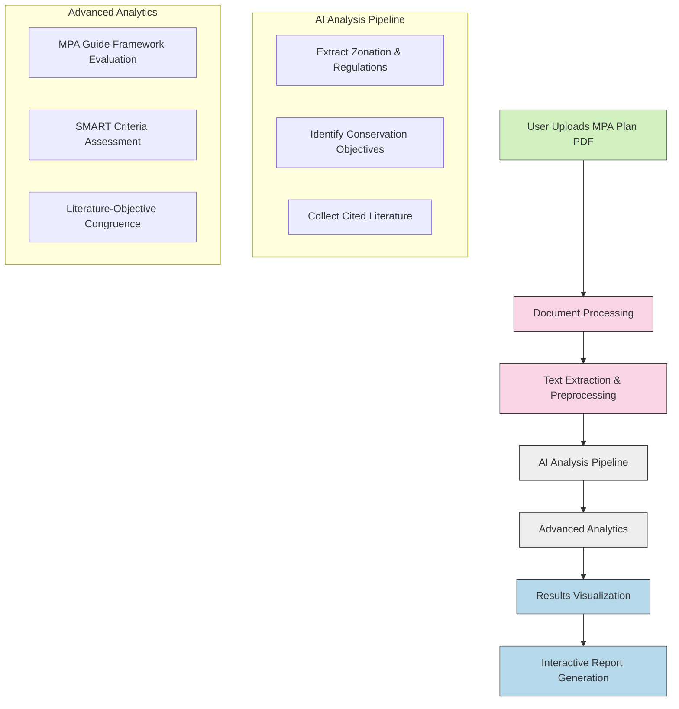

# 🌊 Marine Protected Area Management Plan AI Analysis

[](https://www.python.org/downloads/)
[](https://openai.com/)
[](https://opensource.org/licenses/MIT)
[](https://streamlit.io/)

## 📚 Project Overview

This project harnesses the power of artificial intelligence to analyze Management Plans of Marine Protected Areas (MPAs) in Spanish. The AI extracts critical information from uploaded documents, evaluates regulatory quality, assesses conservation objectives, and analyzes the relevance of cited literature to those objectives.


## 🎯 Key Objectives

Our AI-driven tool accomplishes the following:

* 📋 **Extract and summarize** zonation schemes and associated regulations
* 🔍 **Identify and clearly articulate** conservation objectives
* 📚 **Collect and organize** cited literature in a structured format
* ⚖️ **Assess protection quality** using the MPA Guide framework
* 📊 **Evaluate conservation objectives** using SMART criteria and feasibility metrics
* 🔗 **Analyze congruence** between stated objectives and themes in cited literature

## 🏗️ Architecture Overview

The project employs a modular, prompt-driven pipeline leveraging OpenAI's GPT API, supported by fully open-source frameworks for document processing and data management.

### 💻 Tech Stack

* **AI Model**: OpenAI GPT API (with Spanish language support)
* **Document Processing**: LangChain, Ollama, and PyMuPDF
* **Data Management**: SQLite or PostgreSQL (optional)
* **Web Interface**: Streamlit (interactive UI)

## 🔄 Workflow Diagram



## ⚙️ Prompt-driven Workflow

The workflow is structured step-by-step for clarity and ease of implementation. Each step is defined with detailed instructions for AI-assisted coding, ensuring a systematic approach to processing and analysis.

## 👥 How to Collaborate

We welcome contributions to enhance this project! Here's how you can get involved:

1. **Fork the repository** and create a feature branch
2. **Review the roadmap** in `ROADMAP.md` to understand current priorities
3. **Submit pull requests** with clear descriptions of changes and benefits
4. **Join discussions** by commenting on issues that interest you
5. **Add test cases** for new functionality or bug fixes
6. **Improve documentation** to make the project more accessible

### Contribution Guidelines

* Follow the existing code style and conventions
* Write clear commit messages explaining your changes
* Add appropriate comments and documentation
* Test your changes thoroughly before submitting
* Be respectful and constructive in discussions

## 📋 Getting Started

```bash
# Clone the repository
git clone https://github.com/username/MPAgent.git

# Navigate to the project directory
cd MPAgent

# Install dependencies
pip install -r requirements.txt

# Run the application
streamlit run app.py
```

## 📂 Sample File

For testing purposes, you can use the included sample file:
- `Programa de Manejo Revillagigedo.pdf` - A sample Marine Protected Area management plan in Spanish

## 🚀 Getting Started with the Sample

1. Make sure you have the required dependencies installed:
   ```bash
   pip install -r requirements.txt
   ```

2. Run the application:
   ```bash
   streamlit run app.py
   ```

3. Upload the sample file `Programa de Manejo Revillagigedo.pdf` when prompted

## ⏭️ Next Steps

Check out the `ROADMAP.md` file for the detailed project roadmap and current development priorities. Initial focus will be on implementing the document processing workflow.

## 📄 License

This project is licensed under the MIT License - see the LICENSE file for details.